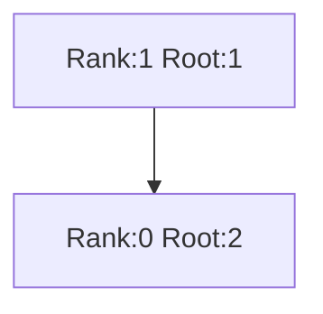
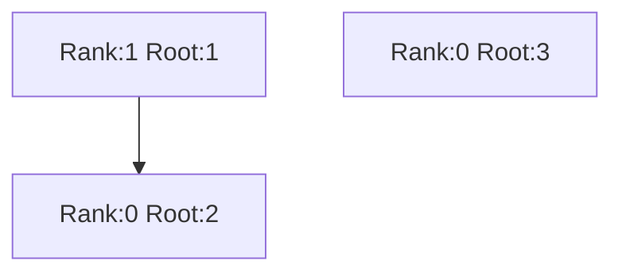
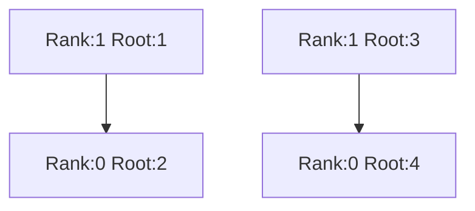
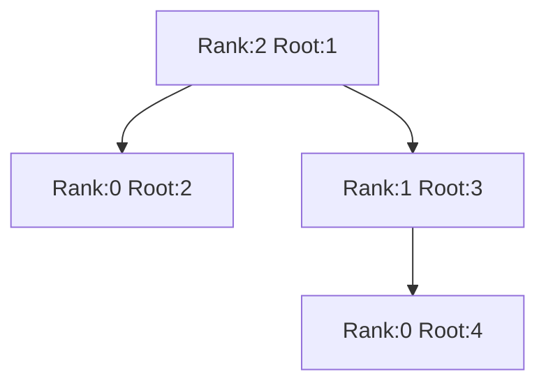
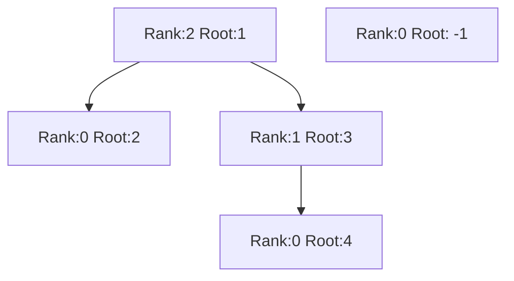
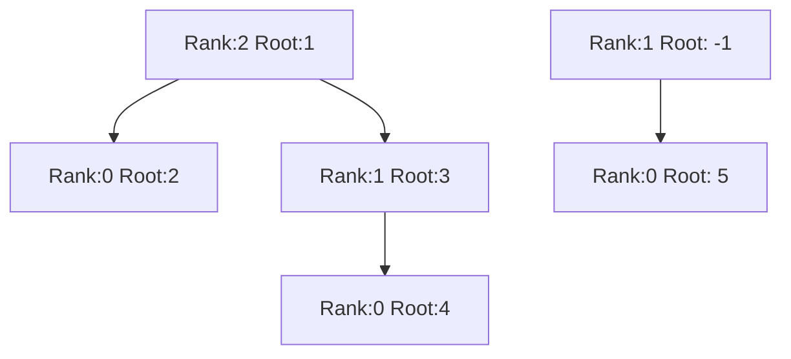
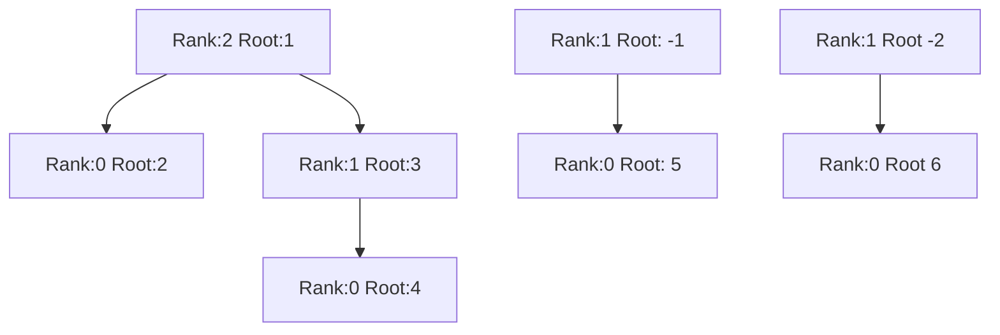
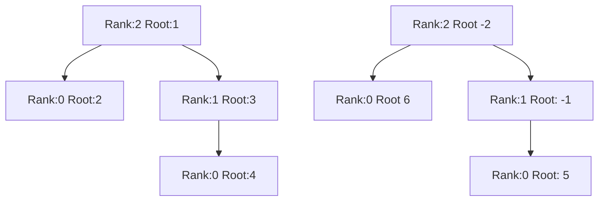
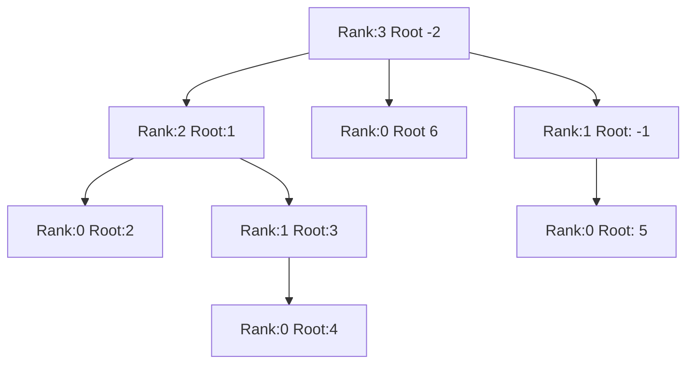
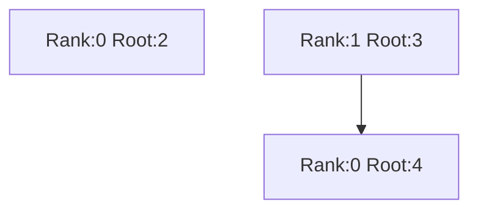

# Documentation of Binomial Heap

## Binomial Tree

A Binomial Heap is a List of Binomial Trees and a compare function.

A binomial tree is a tree with nodes that have a rank and some children.

A node with rank $r$ has $r$ child nodes. The ranks of its children are $r - 1$, $r - 2$ ... $0$, respectively.

## Insert

The insert operation is shown as follows:

Insert 1 into an empty biheap:

Insert 2 will link trees:

Insert 3:

Insert 4, first link tree:

Then insert tree:

Let's try to add -1 and 5:

Add -1:

Add 5, first link tree:

Then insert tree will not change the biheap, because the size of its trees is 2^2 and 2^1.

Again, if we add 6 and -2.

First, it will be:

Then, merge trees (note: $-2 \leq -1$):

Once again, rank 2 is not less than rank 2, so it triggers another tree insertion:

Now, we have a binomial tree with 8 nodes.

## Remove

Now, the implementaion of 
`biheap-insert`, `biheap-merge` and `biheap-min` should be easy to understand.

However, the `biheap-rm-min` is still unclear. We need to find the tree contains the minimum element. For example, as the following biheap:

The selected tree is the tree with two nodes.

Then we split the biheap into two biheaps, biheaps without the selected tree, and the selected tree. For the selected tree, remove its root. Notice that we always add the node with larger rank to the head of the children, but the heap is ordered by ascending rank. So, remove the node will remain its children with reverse order.

For example, if we remove the root:

Then it will become a biheap:

